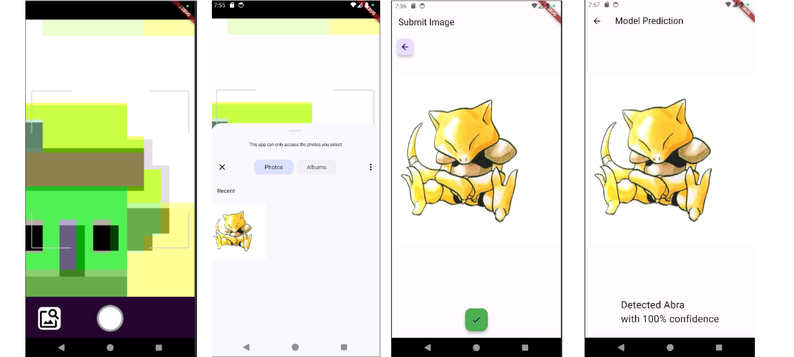

# Deploying-YOLO-Object-Detection-in-Flutter

## Project Description
The aim of this project is to deploy a YOLOv8 model trained on Pokemon images in a Flutter application. 

## How To Run It
1. Download this repository
2. Download and install Flutter ([Tutorial:](https://docs.flutter.dev/get-started/install))
3. Download and install Android Studio ([Tutorial:](https://developer.android.com/codelabs/basic-android-kotlin-compose-install-android-studio#0))
4. Open Android Studio and open the pokemon_model_deployment project
5. Create a device running Android 34 ([Tutorial:](https://developer.android.com/studio/run/managing-avds))
6. In the terminal run the following command to get the dependencies ``Flutter pub get``
7. Before running the program you'll need to start up the device you created earlier ([Tutorial:](https://developer.android.com/studio/run/emulator))
8. To see the running device, open the Running Devices tab
9. Now run the program

## How To Use The App
After opening the app you will be prompted to gain access to the camera, you should agree to these messages. From here you can take a picture or select a picture from your stored images. Once a picture has been taken or selected you may review the image before submitting it to the model for inference. Once submitted, the model will begin inference, once finished a message will appear on the screen with the results of the inference.

## Screenshots of the App

## Acknowledgements
This project utilizes code from the `flutter_vision` example by Vladimir Hudnitsky, available at
https://github.com/vladiH/flutter_vision/blob/master/example/lib/main.dart. Thanks to the author(s)
for providing the example which greatly assisted in the development process.
